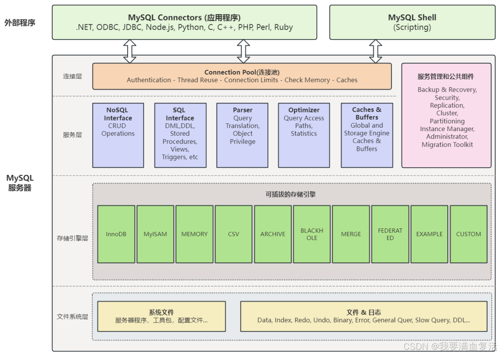
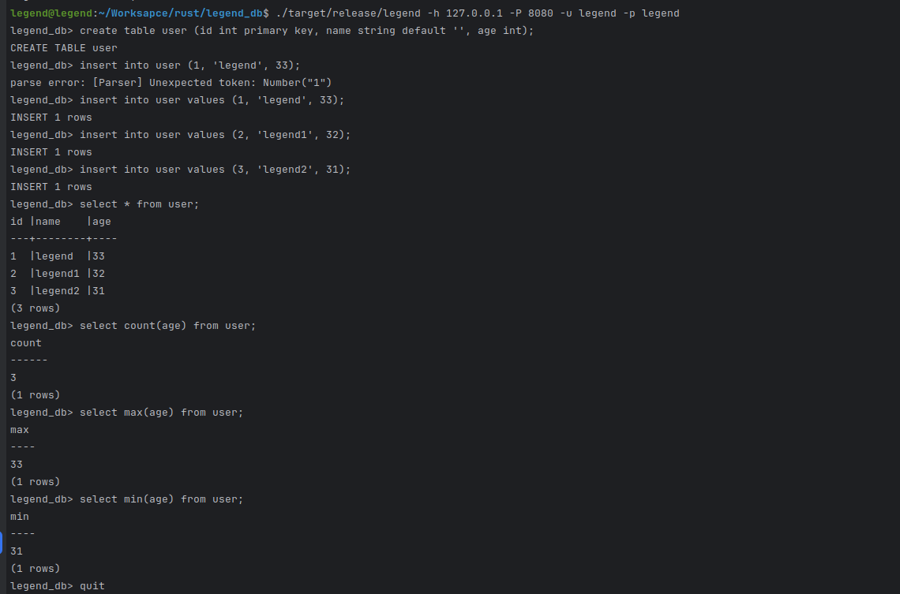

# legend_db

## SQL数据库架构概述

### Parser解析器

SQL语言本身是一个文本数据，数据库接收到SQL语言之后，需要验证其合法性，然后再哦安短是否能继续执行。

所以parser的主要功能就是对SQL语言进行词法和语法分析，生产抽象语法树（Abstract Syntax Tree），这一阶段也会校验明显的语法错误

#### Planner执行计划

执行计划通常以树状结构的形式表达，其中包含了执行查询所需要的各种操作，比如索引扫描，表扫描，连接操作等等

### Optimizer优化器

Optimizer负责根据执行计划生成的各种执行路径，在这些执行路径中选择最优的执行方案

优化器的目标在保证查询结构正确性的前提下，尽可能地降低查询的成本，包括CPU、内存和IO等资源的消耗。

为了达成这个目标，优化器会考虑多种因素，如索引的利用，连接顺序的优化，统计信息的使用等

### Executor执行器

执行器主要负责具体去执行执行计划中的各个节点，一般的执行器模型采用推或者拉的模型。

比如常见的基于pull的火山模型，会从最顶层的节点开始执行，循环拉取下层节点执行的结果，直到完全执行并返回正确的结果

### Transaction事务

事务是数据库中重要的概念，它是一系列数据库操作的逻辑单元，要么全部执行成功，要么全部执行失败。

数据库内核中的事务管理组件负责确保事务的原子性，一致性，隔离性和持久性（ACID属性）。

事务管理组件会对事务进行管理和控制，包括事务的开始、提交、回滚等操作，并处理并发事务之间的冲突

### Storage存储引擎

存储引擎是数据库内核中负责管理数据存储和检索的组件，它负责将数据存储到物理存储介质中，并提供高效的数据访问接口。

存储引擎也会包含内存中的Buffer管理以及磁盘上的Page数据组织等内容

Mysql**的架构**

## 介绍

此数据库是采用`Rust`编码实现，内存存储采用`Rust`自带的`Btreemap`数据实现

持久化采用较为简单的`Bitcask`模型，后续添加`B+`树，`LSM`树，并添加持久化模型配置

采用`thiserror`处理相关错误

采用`bincode`序列化和反序列化

采用`tokio`实现服务端和客户端

## linux编译
`cargo build --release`

## linux编译windows
`cargo build --target x86_64-pc-windows-gnu --release`
## 运行
* 启动服务端legend_db_server
* 启动客户端
`legend -h 127.0.0.1 -P 8080 -u legend -p legend`
## 运行效果如下
