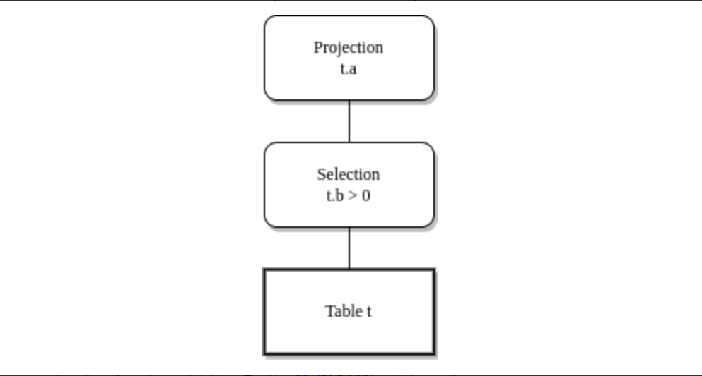

# 解析器Lexer实现

## Parser概述

`Parser`主要的功能是将`SQL`语句文本按照预先定义的`SQL`语法规则进行解析，并将其转换为抽象语法树（`Abstract Syntax Tree， AST`）。

抽象语法树是计算机科学中编译原理的一个术语，它以树形表现编程语言的语法结构。对应`SQL`语句来说，也是同样的道理，例如，对于`SQL select a from table where b >0;`将会被转换为



常见的语法和语法分析工具有`lex`，`yacc`，`flex`，`bison`等等

例如`PostgresSQL`数据库的语法和词法分析就是使用的`flex`和`bison`工具

**参考资料**

https://chuquan.me/2022/07/10/compiler-principle-tool-yacc/

https://zhuanlan.zhihu.com/p/143867739

https://pandolia.net/tinyc/ch8_flex.html

https://www2.cs.arizona.edu/~debray/Teaching/CSc453/DOCS/tutorial-large.pdf

https://yearn.xyz/posts/techs/%E8%AF%8D%E6%B3%95%E8%AF%AD%E6%B3%95%E5%88%86%E6%9E%90%E5%9F%BA%E7%A1%80/

http://home.ustc.edu.cn/~guoxing/ebooks/flex%E4%B8%8Ebison%E4%B8%AD%E6%96%87%E7%89%88.pdf

## Lexer实现

Lexer是解析器词法分析的部分，主要是将一条`SQL`语句转换为可连续读取的`Token`，然后供`parser`进行语法分析并转换为抽象语法树

例如将一个`SQL`转换为抽象语法树，需要经历的步骤大致如下

`Sql-->Lexer-->Token-->Parser-->AST`

`Lexer`的功能是将一条`SQL`语句进行拆分，并将不同的关键字声明为`Token`。`Lexer`并不关心这些`Token`的实际含义，它会将`SQL`中的一些空白字符清楚，并识别出`SQL`中的数字，字符串，关键字等。

并且会进行一些`SQL`基本语法的预处理，比如明显的语法错误，不识别的关键字的等等。

例如，下面的`SQL`片段经过解析之后，会转换为对顶的`Token`

3.14 + UPDATE 'abc'

```rust
Token::Number("3.14")

Token::Plus

Token::Keyword(Keyword::Update)

Token::String("abc")
```

`Parser`会将`Lexer`生产的`Token`进行解析遍历，并且生成抽象语法树。

在目前的阶段，我们只专注于搭建词法分析的基础结构，所以我们可以实现一个最简单的`Lexer`即可，后续有其他的类型的`SQL`语句，就可以很方便的在这之上进行添加。

```rust
#[derive(Debug, Clone, PartialEq)]

pub enum Keyword {

​    Create,

​    Table,

​    Database,

​    Int,

​    Integer,

​    Boolean,

​    Bool,

​    String,

​    Text,

​    Varchar,

​    Float,

​    Double,

​    Select,

​    From,

​    Where,

​    Insert,

​    Update,

​    Set,

​    Delete,

​    Alter,

​    Show,

​    Drop,

​    Into,

​    Values,

​    True,

​    False,

​    Default,

​    If,

​    Not,

​    Null,

​    Exists,

​    Primary,

​    Key,

}
```

```rust
#[derive(Debug, Clone)]
#[derive(PartialEq)]
pub enum Token {
    // 关键字
    Keyword(Keyword),
    // 标识符
    Identifier(String),
    // 数字
    Number(String),
    // 字符串
    String(String),
    // 左括号
    LeftParen,
    // 右括号
    RightParen,
    // 左中括号
    LeftBracket,
    // 右中括号
    RightBracket,
    // 左大括号
    LeftBrace,
    // 右大括号
    RightBrace,
    // 点号
    Dot,
    // 逗号
    Comma,
    // 分号
    Semicolon,
    // 星号
    Star,
    // 加好
    Plus,
    // 减号
    Minus,
    // 乘号
    Asterisk,
    // 除号
    Slash,
    // 冒号
    Colon,
    // 等号
    Equal,
    // 大于号
    GreaterThan,
    // 小于号
    LessThan,
    // 等于号
    DoubleEqual,
    // 不等于号
    NotEqual,
    // 逻辑与
    And,
    // 逻辑或
    Or,
    // 空白
    Whitespace,
}
```

Token主要分为五大类型：

`Keyword`：关键字

`Ident`：其他类型的字符串Token 例如表明、列名

`String`：字符串类型的数据

`Number`：数值类型，比如整数和浮点数

符号类型：比如括号，逗号，星号等等

在代码实现上，我们主要利用`Peekable`接口，对`SQL`语句进行拆分，然后解析成不同的`Token`

```rust
pub struct Lexer<'a'> {
	iter: Peekable<Chars<'a'>>
}

impl<'a> Iterator for Lexer<'a> {
    type Item = LegendDBResult<Token>;

    fn next(&mut self) -> Option<Self::Item> {
        match self.scan() {
            Ok(Some(token)) => {Some(Ok(token))},
            Ok(None) => {self.iter.peek().map(|_| Err(LegendDBError::NotSupported))},
            Err(e) => {Some(Err(e))},
        }
    }
}
```

